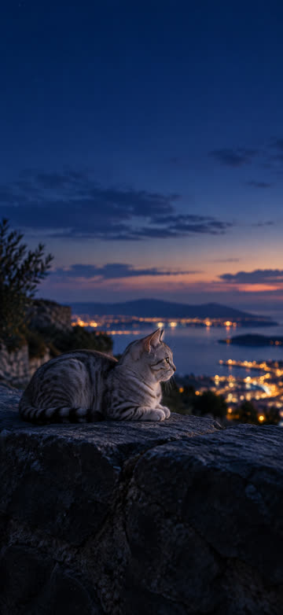
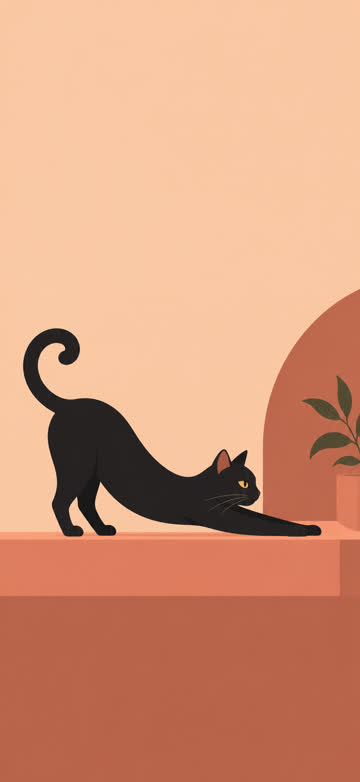
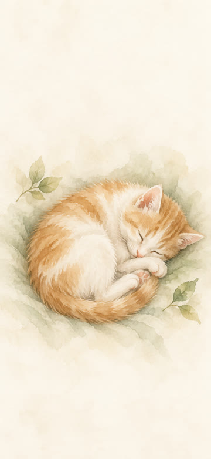
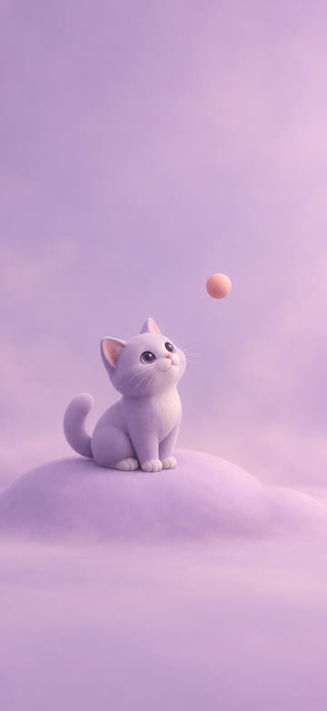
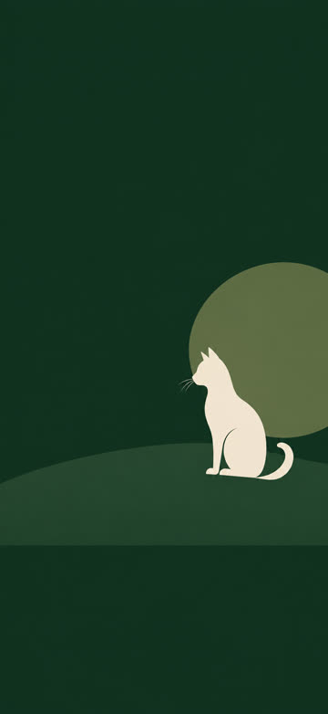
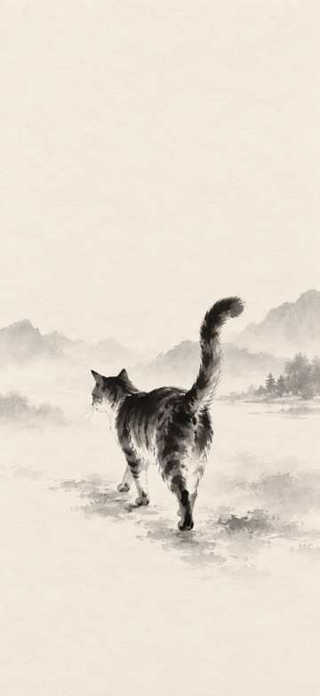

# wallsafe

**Phone wallpapers that respect the island, the clock, and the dock.**

A Codex skill for batch-generating phone wallpapers from a short preference prompt — same theme, different visual languages, sized for a real device.

> 中文：给 Codex 用的手机壁纸批量 skill。不是「随便出几张竖图」，而是按锁屏时钟、灵动岛、Dock 遮挡来设计构图，并交付真机像素。

---

## Why wallsafe

Most image prompts treat a phone wallpaper like a tall poster. On a real iPhone, the **Dynamic Island**, **lock clock**, and **Home Screen dock** eat the frame. wallsafe bakes those occlusion bands into every prompt, then finishes at **exact device resolution** (for example iPhone 17 Pro Max `1320×2868`).

It also refuses the lazy “sticker pack” pattern: one theme, **six to ten different media styles** — photoreal, flat vector, watercolor, clay 3D, color-field, ink wash — not eight near-identical cats in a row.

---

## Gallery — theme: cats · iPhone 17 Pro Max

Generated on Codex with built-in image gen, then aligned to `1320×2868`.

| Photoreal ambient | Flat vector | Soft watercolor |
| :---: | :---: | :---: |
|  |  |  |

| 3D clay | Minimal color-field | Ink wash |
| :---: | :---: | :---: |
|  |  |  |

Full-resolution PNGs: [`examples/iphone-17-pro-max/cats/`](examples/iphone-17-pro-max/cats/)

---

## What you get

- **Wallpaper-safe composition** — calm top band, quieter dock band, lock-clock-friendly upper center
- **Device delivery sizes** — not “roughly 9:16”
- **Style wheel** — same subject, different craft languages
- **Codex-ready workflow** — works with ChatGPT/Codex auth; post-resize when the model ignores exact pixels
- **`manifest.json`** — prompts, sizes, and known limitations recorded per batch

---

## Quick start (Codex)

```bash
# copy into your Codex skills directory
cp -R skills/wallsafe ~/.codex/skills/wallsafe

# then, in Codex:
# "Use wallsafe. iPhone 17 Pro Max. Theme: rainy neon city. 8 wallpapers."
```

Or point Codex at this repo and say: *follow `skills/wallsafe/SKILL.md`*.

---

## Skill highlights

| Rule | Why it matters |
| --- | --- |
| Top ~12–15% low-detail | Status bar + Dynamic Island + lock clock |
| Bottom ~15–20% quieter | Home Indicator + dock icons |
| No text / frames / mockups by default | Wallpapers are backgrounds, not ads |
| Generate → ffmpeg to delivery size | Models often ignore exact `W×H` |
| Style diversity within one theme | A batch you can actually choose from |

---

## Device table (excerpt)

| Device | Delivery |
| --- | --- |
| iPhone 17 Pro Max | `1320×2868` |
| iPhone 17 Pro | `1206×2622` |
| Android FHD+ common | `1080×2340` |

When the API requires multiples of 16, generate nearby (e.g. `1312×2864`) then crop/scale to delivery. Details in [`SKILL.md`](SKILL.md).

---

## Design note / 设计说明

English: wallsafe is a small production spec for wallpapers — occlusion, delivery pixels, and tasteful variety — wrapped as a Codex skill so you can ask in one sentence and get a usable set.

中文：核心不是模型会不会画，而是壁纸作为**产品交付物**的规格：遮挡区、真机分辨率、同主题多风格。偏好一句话进来，批次成品出去。

---

## License

MIT

---

Built for people who care how a wallpaper looks **under** the clock.
